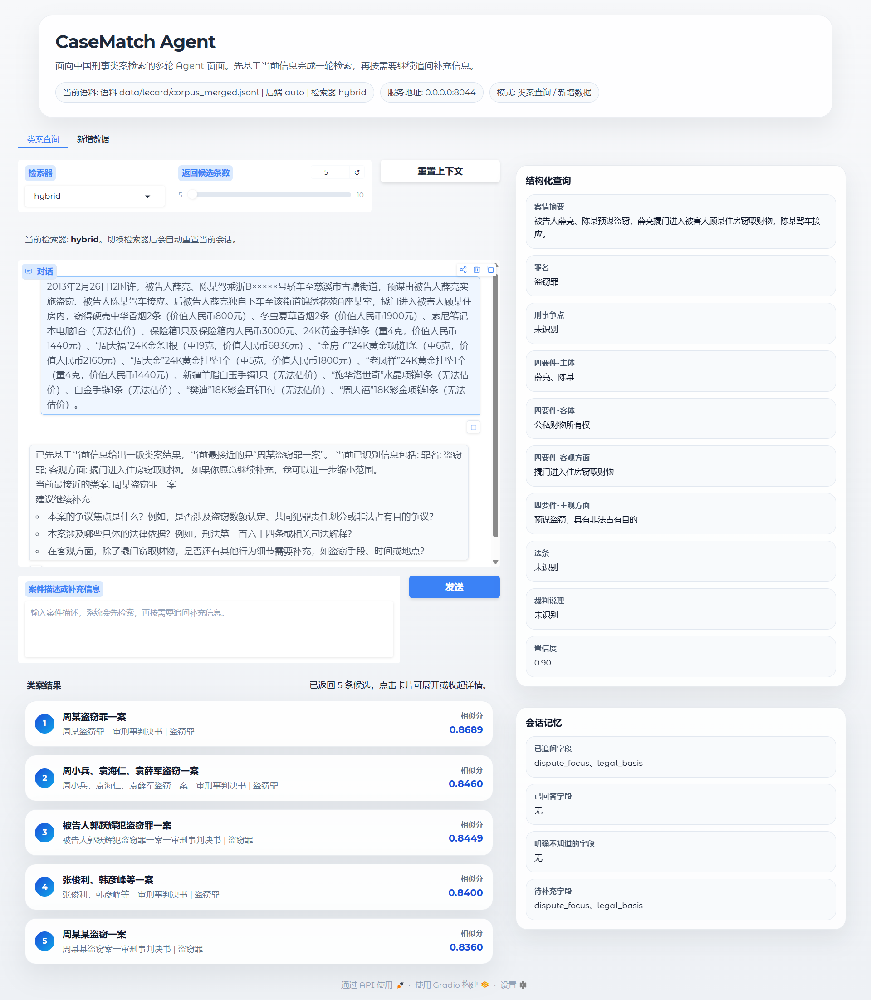

# CaseMatch Agent

CaseMatch Agent is an open-source prototype for Chinese criminal similar-case retrieval.

It combines:

- LLM-based structured query extraction
- LangGraph-based agent orchestration
- LangGraph checkpoint-backed multi-turn session state
- multi-turn clarification when user information is insufficient
- LanceDB vector recall with SQLite fallback
- BM25 / BGE-M3 / Hybrid reranking
- incremental case import from raw judgment text

The current default corpus is based on [`LeCaRD`](https://github.com/myx666/LeCaRD), and the current schema is criminal-only.

## Features

- Query understanding is not pure text matching. The system extracts structured fields such as `case_summary`, `charges`, `dispute_focus`, `legal_basis`, and `four_elements`.
- Retrieval is two-stage. Candidate cases are recalled from the database first, then reranked by BM25, BGE-M3, or a hybrid scorer.
- The agent always returns a first-round retrieval result before deciding whether it should ask follow-up questions.
- New cases can be imported from raw jsonl through either a CLI script or the Gradio web UI.

## Installation

```bash
pip install -e .
pip install python-dotenv gradio jieba lancedb huggingface_hub
pip install FlagEmbedding
```

## Configuration

```bash
cp .env.example .env
```

All runtime configuration is managed through `.env`. The most important variables are:

- `OPENAI_API_KEY`, `OPENAI_API_BASE`, `OPENAI_MODEL`
- `CASEMATCH_BGE_MODEL_PATH`
- `CASEMATCH_RANKER`
- `CASEMATCH_GRADIO_HOST`, `CASEMATCH_GRADIO_PORT`
- `CASEMATCH_HF_REPO_ID`, `CASEMATCH_HF_REPO_TYPE`, `CASEMATCH_HF_REVISION`, `CASEMATCH_HF_LOCAL_DIR`

Project entrypoints already load `.env` automatically.

## Quick Start

1. Install dependencies.
2. Copy `.env.example` to `.env` and fill your LLM configuration.
3. Download the dataset from Hugging Face.
4. Run the CLI agent or the Gradio UI.

## Download Data from Hugging Face

The public dataset used by this project is:

- `Yuel-P/CaseMatch-Agent-data`

Then set these variables in `.env`:

```dotenv
CASEMATCH_HF_REPO_ID=Yuel-P/CaseMatch-Agent-data
CASEMATCH_HF_REPO_TYPE=dataset
CASEMATCH_HF_REVISION=main
CASEMATCH_HF_LOCAL_DIR=data
HF_TOKEN=
```

`HF_TOKEN` can be left empty if the dataset repo is public.

Download the dataset:

```bash
python scripts/download_hf_data.py
```

If you want to override the repo id manually:

```bash
python scripts/download_hf_data.py \
  --repo-id Yuel-P/CaseMatch-Agent-data \
  --repo-type dataset \
  --revision main \
  --local-dir data
```

After download, your local repository should contain files such as:

```text
data/
  README.md
  lecard/
    README.md
    corpus_merged.jsonl
    queries.jsonl
    qrels.jsonl
    candidate_pools.jsonl
```

## Run the Agent

### CLI

```bash
PYTHONPATH=src python -m casematch_agent
```

### Gradio

```bash
PYTHONPATH=src python -m casematch_agent.gradio_app --host 127.0.0.1 --port 7860
```

#### Interface Preview

<p align="center">
  
</p>

The Gradio UI supports:

- multi-turn similar-case retrieval
- structured query display
- retrieval result inspection
- in-page raw case jsonl import

## Build or Rebuild LanceDB

```bash
python scripts/build_lancedb_index.py \
  --corpus data/lecard/corpus_merged.jsonl \
  --lancedb-uri data/cases.lancedb \
  --bge-model-path /data/BAAI/bge-m3
```

Force rebuild:

```bash
python scripts/build_lancedb_index.py \
  --corpus data/lecard/corpus_merged.jsonl \
  --lancedb-uri data/cases.lancedb \
  --bge-model-path /data/BAAI/bge-m3 \
  --force-rebuild
```

## Import New Cases

You can import new criminal cases from raw jsonl.

Input requirement:

- each line must match the `raw_data` schema
- the minimal required fields are:
  - `case_name`
  - `document_name`
  - `fact_text`
  - `judgment_text`
  - `full_text`

Import via CLI:

```bash
python scripts/add_cases_to_db.py \
  --input data/new_cases_raw.jsonl \
  --corpus data/lecard/corpus_merged.jsonl \
  --lancedb-uri data/cases.lancedb \
  --db-backend auto \
  --bge-model-path /data/BAAI/bge-m3
```

Import flow:

1. Read the raw jsonl file
2. Use the LLM API to extract `structured_data`
3. Generate a new non-conflicting random `case_id`
4. Append the record to `data/lecard/corpus_merged.jsonl`
5. Sync LanceDB, or fall back to SQLite refresh in `auto` mode

The Gradio UI exposes the same import flow from the browser.

## Rerankers

### BM25

Use:

```bash
PYTHONPATH=src python -m casematch_agent --ranker bm25
```

Implementation: [src/casematch_ranker/bm25.py](src/casematch_ranker/bm25.py)

### BGE-M3

Use:

```bash
PYTHONPATH=src python -m casematch_agent --ranker bge_m3 --bge-model-path /data/BAAI/bge-m3
```

Implementation: [src/casematch_ranker/bge_m3.py](src/casematch_ranker/bge_m3.py)

### Hybrid

Use:

```bash
PYTHONPATH=src python -m casematch_agent \
  --ranker hybrid \
  --bge-model-path /data/BAAI/bge-m3 \
  --hybrid-bge-weight 1.0 \
  --hybrid-fe-weight 0.1 \
  --hybrid-lc-weight 0.2
```

Implementation: [src/casematch_ranker/hybrid.py](src/casematch_ranker/hybrid.py)

## Offline Experiments

```bash
python scripts/hybrid_experiment.py \
  --corpus data/lecard/corpus_merged.jsonl \
  --queries data/lecard/queries.jsonl \
  --labels data/lecard/qrels.jsonl \
  --candidate-pools data/lecard/candidate_pools.jsonl \
  --methods bm25,bge_m3,hybrid \
  --bge-model-path /data/BAAI/bge-m3 \
  --hybrid-bge-weight 1.0 \
  --hybrid-fe-weight 0.1 \
  --hybrid-lc-weight 0.2
```

For a lighter smoke test:

```bash
python scripts/hybrid_experiment.py \
  --corpus data/lecard/corpus_merged.jsonl \
  --queries data/lecard/queries.jsonl \
  --labels data/lecard/qrels.jsonl \
  --candidate-pools data/lecard/candidate_pools.jsonl \
  --methods bm25 \
  --max-queries 5
```

## Experimental Results on LeCaRD

The following results were obtained on the processed `LeCaRD` benchmark used in this repository.

Notes:

- All metrics are reported as percentages. Higher is better.
- `*-baseline` means the retriever uses the full judgment text as input.
- Other variants indicate which structured field or field combination is used.
- `bge_m3-fused-bm25` is the current hybrid retrieval strategy used in this project:
  `BGE-M3(case_summary + dispute_focus + court_reasoning) + BM25 bonus(four_elements, laws_and_charges)`.
- `bge_m3-fused_all-bm25` is the full-structure hybrid variant:
  `BGE-M3(case_summary + dispute_focus + court_reasoning + four_elements + laws_and_charges) + BM25 bonus`.

### BM25 and BGE-M3 Variants

| Method | P@1 | P@3 | P@5 | P@10 | NDCG@5 | NDCG@10 | NDCG@15 | NDCG@20 | NDCG@30 | MAP | MRR |
| --- | ---: | ---: | ---: | ---: | ---: | ---: | ---: | ---: | ---: | ---: | ---: |
| `bm25-baseline` | 52.34 | 41.74 | 40.75 | 37.20 | 61.24 | 64.11 | 68.14 | 71.86 | 79.71 | 47.71 | 63.54 |
| `bm25-case_summary` | 16.85 | 20.97 | 20.45 | 20.11 | 43.56 | 49.33 | 53.61 | 58.63 | 66.32 | 26.71 | 34.39 |
| `bm25-dispute_focus` | 17.95 | 18.80 | 17.44 | 14.62 | 34.82 | 35.89 | 36.55 | 37.51 | 41.70 | 19.74 | 32.46 |
| `bm25-four_elements` | 8.99 | 12.36 | 13.03 | 12.81 | 35.41 | 39.85 | 44.43 | 47.83 | 55.94 | 18.41 | 23.41 |
| `bm25-court_reasoning` | 10.11 | 12.73 | 13.03 | 14.83 | 33.21 | 37.21 | 39.61 | 41.39 | 45.34 | 17.94 | 25.19 |
| `bm25-laws_and_charges` | 7.87 | 7.87 | 7.64 | 7.19 | 32.60 | 36.02 | 39.97 | 42.91 | 47.92 | 14.29 | 17.46 |
| `bge_m3-baseline` | 38.32 | 40.19 | 40.00 | 38.79 | 59.43 | 63.17 | 65.85 | 68.74 | 75.61 | 44.24 | 54.25 |
| `bge_m3-case_summary` | 55.14 | 48.29 | 45.05 | 41.59 | 65.60 | 67.84 | 70.07 | 72.74 | 78.10 | 52.25 | 66.07 |
| `bge_m3-dispute_focus` | 24.30 | 20.87 | 18.88 | 16.26 | 30.80 | 31.19 | 31.71 | 32.08 | 35.10 | 23.37 | 35.92 |
| `bge_m3-four_elements` | 53.27 | 51.09 | 48.22 | 40.75 | 64.56 | 65.33 | 67.50 | 69.84 | 75.25 | 50.39 | 66.07 |
| `bge_m3-court_reasoning` | 41.12 | 41.43 | 40.00 | 36.82 | 59.51 | 61.98 | 63.90 | 66.03 | 70.58 | 46.20 | 58.01 |
| `bge_m3-laws_and_charges` | 40.19 | 42.37 | 42.24 | 39.53 | 59.65 | 61.92 | 63.31 | 64.84 | 69.12 | 46.44 | 55.16 |
| `bge_m3-case_summary+dispute_focus+court_reasoning` | 59.81 | 51.71 | 48.04 | 44.39 | 69.55 | 72.49 | 74.32 | 75.77 | 80.47 | 55.97 | 70.63 |
| `bge_m3-case_summary+dispute_focus+court_reasoning+four_elements+laws_and_charges` | 61.68 | 53.58 | 48.04 | 44.67 | 70.45 | 73.27 | 75.57 | 76.86 | 81.73 | 57.52 | 72.88 |
| **`bge_m3-fused-bm25`** | **58.88** | **53.89** | **51.78** | **46.82** | **72.92** | **75.55** | **77.67** | **79.57** | **83.84** | **59.53** | **71.97** |
| `bge_m3-fused_all-bm25` | 58.88 | 54.21 | 51.59 | 47.57 | 72.60 | 75.60 | 77.59 | 79.59 | 83.53 | 59.49 | 70.96 |

The current default hybrid choice is **`bge_m3-fused-bm25`**. In these experiments, it gives the strongest overall tradeoff among the tested settings, especially on `P@5`, `NDCG@5`, `NDCG@30`, and `MAP`, while remaining simpler than the full-structure fused variant.

## Testing

```bash
PYTHONPATH=src python -m unittest discover -s tests
```

## Project Scope

- Current default corpus: [`LeCaRD`](https://github.com/myx666/LeCaRD)
- Current default schema: criminal-only
- Current primary database: LanceDB
- Current fallback database: SQLite

Schema details are documented in [SCHEMA.md](SCHEMA.md).

## Repository Layout

```text
src/casematch_agent/
  agent.py
  clarification.py
  corpus.py
  extractor.py
  gradio_app.py
  lancedb_store.py
  llm.py
  models.py
  retriever.py
  sqlite_store.py

src/casematch_ranker/
  bm25.py
  bge_m3.py
  hybrid.py

scripts/
  add_cases_to_db.py
  build_lancedb_index.py
  download_hf_data.py
  hybrid_experiment.py
```

## Notes

- If you publish this repository, keep `.env` as a template only. Do not commit real secrets.
- If you use a provider other than OpenAI, make sure it supports the OpenAI-compatible `chat/completions` API shape used in [src/casematch_agent/llm.py](src/casematch_agent/llm.py).

## Acknowledgements

This project benefited from substantial assistance from multiple general-purpose AI systems during design and implementation, especially ChatGPT, Claude, and DeepSeek. They helped with feature design, code iteration, debugging, documentation, and engineering tradeoff exploration throughout the project.
